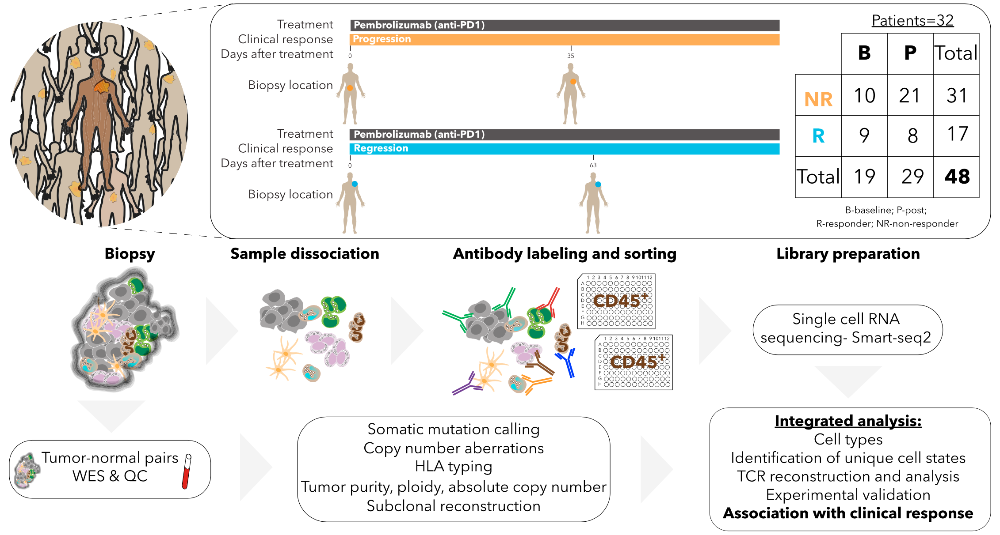
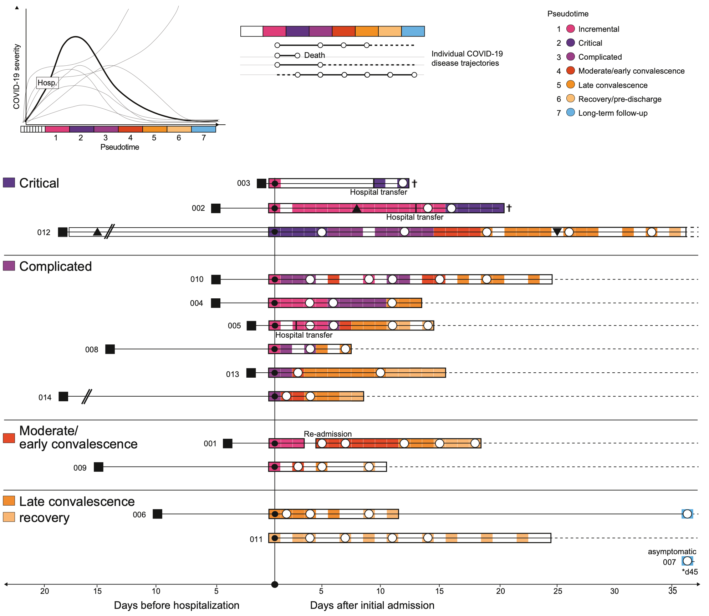
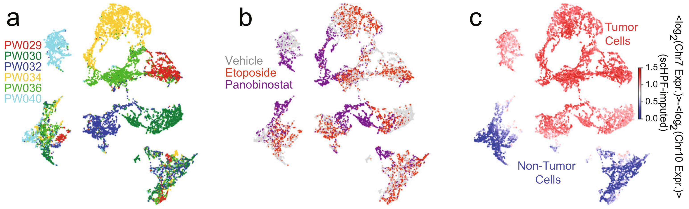
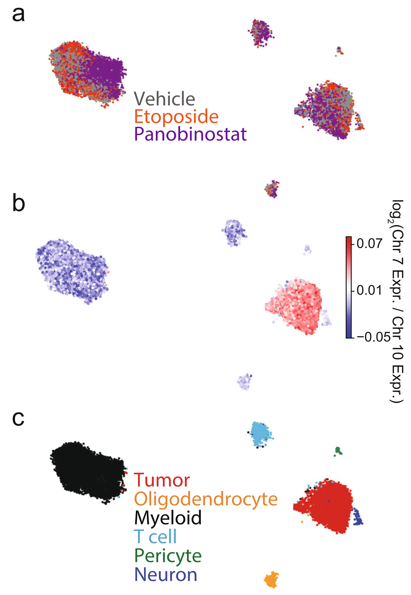
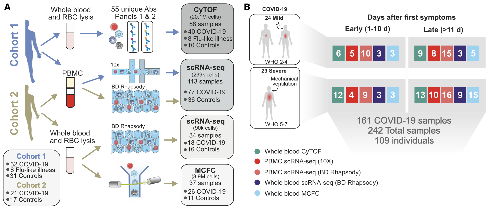
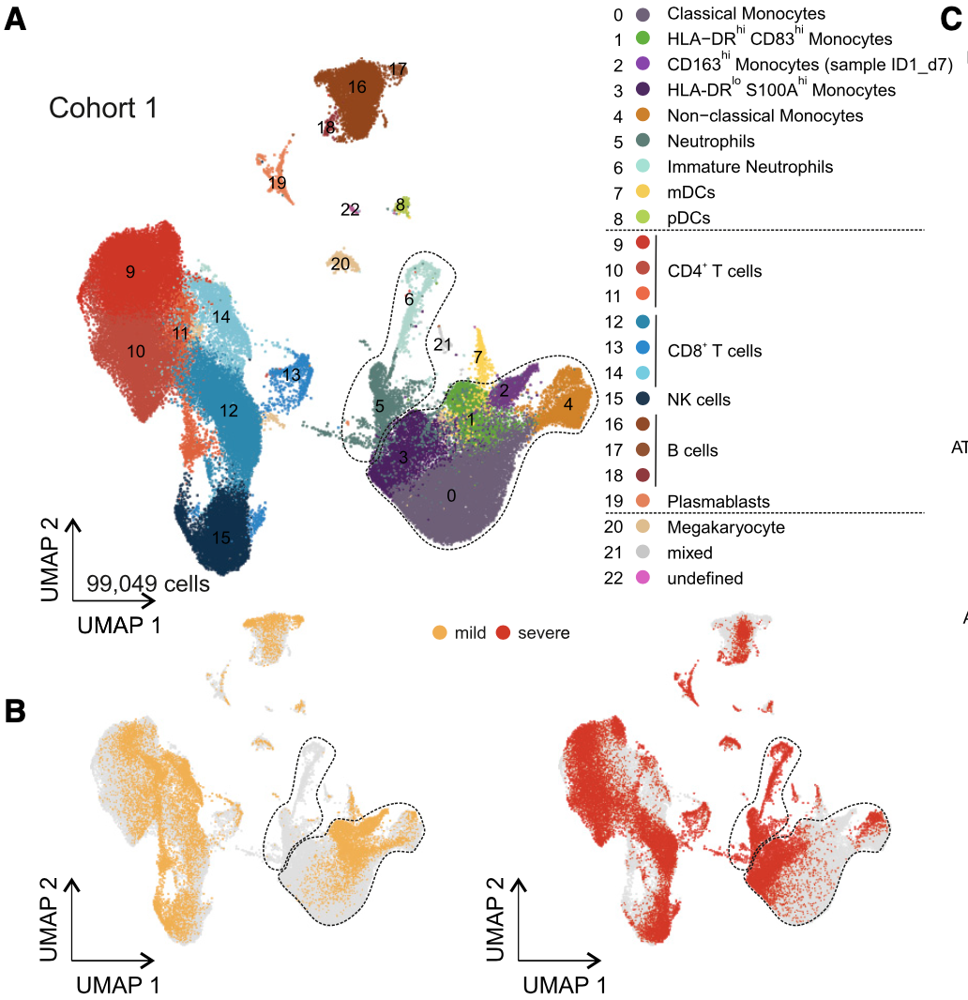
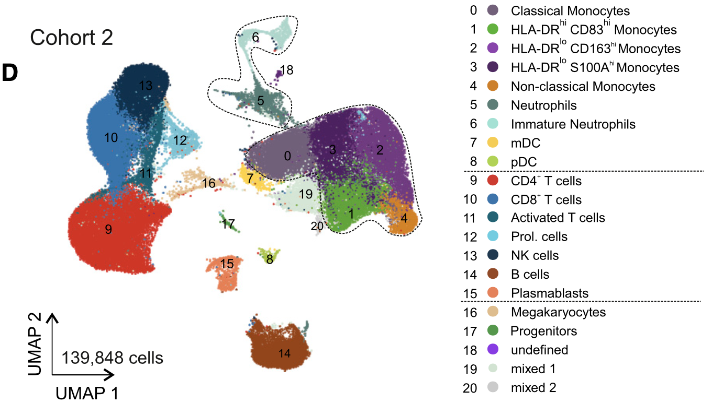
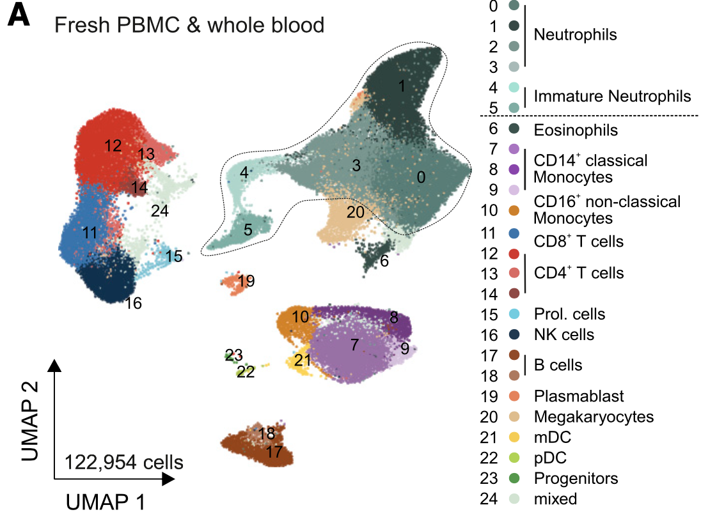

# Datasets

## Melanoma
Profile the patients with Melanoma and are treated with checkpoint therapy (there are responders and non-responders). 16291 cells from 48 patient samples (biopsies, from 32 patients), including 11 patients with longitudinal biopsies and 20 patients with 1 biopsy (or 2 for one patient), taken either at baseline or during treatment.

we classified each of the 48 tumor samples based on radiologic assessments into progression/non-responder (NR; n = 31, including SD/PD samples) or regression/responder (R; n = 17, including CR/PR samples)

We treated 48 tumor samples as 48 batches, non-responder and responder are two conditions. Diagonal case.

## COVID-scINSIGHT
The covid-19 dataset that was used in scINSIGHT. The dataset is separated into different cell types, including B cells, Cell precursors, megakaryocytes, and Monocytes (Other cell types are missing and the author didn't respond to our request). B cell was the primary object discussed in the scINSIGHT paper. 

There are totally 14 patients (13 + 1 recovery control, cohort 1), the PBMC cells are used for scRNA-seq. Multiple samples are generated for each patient along the disease pseudo-time.

#### Bcells:
There are 22190 cells (33 Batches, naming patient id _ timepoint), including 11509 memory B cells, 3993 naive B cells, 383 transitional B cells, 6295 PBs (Plasmablasts). Meta-cell information:
* orig.ident: patient id _ timepoint (should be batches)
* Patient: patient id
* Timepoint: timepoint of sampling, not the pseudotime, of the order 'TA', 'TA2', 'TB', 'TC', 'TE', 'rec' for each patient
* Pseudotime_name/Pseudotime: severity of the disease (should be used as condition)
* Bcell_subtypes: the re-annotated cell types following the online tutorial.

## GBM treatment
Drug treatment on GBM patient. Here we use the data from figure 4 and figure 5. In the directory `GBM_treatment`, we have the data downloaded from GEO website `GSE148842_RAW`, and the data obtained from the user given one-drive `annotated`. Noted that the cells in GEO website is not filtered, and the author suggest that we use the one-drive data. 

The naming of one-drive data follows:
* The merged expression metrices (xxx.matrix.txt.bz2) for each patient sample
* The corresponding numerical sample identity (xxx.samples.txt)
* The corresponding annotation file (xxx.mstatus.txt) for tumor (‘1’) and nontumor cells (‘0’). 
* There's an excel file with the information of sample names and the corresponding treatment conditions and numerical sample ID.

In the folder `Fig4` we have the selected sub-dataset correspond to the figure 4. The `processed` folder has the data that we can use (genes filtered). The `raw` folder has the data before filtering. It has two cell types including tumor and non-tumor, and two gender, two conditions (panobinostat and control, selected from three conditions, because the two have stronger difference). Totally six patients.

In the folder `Fig5`, we have the selected sub-dataset correspond to the figure 5. The `processed` folder has the data that we can use (genes filtered). The `raw` folder has the data before filtering. It has ten samples from one patient, which is treated with three different conditions.

## COVID19-3

COVID19 dataset with conditions: mild and severe; early and late; gender. Sub-datasets:

* 10x PBMC: from cohort 1, including 18 patients (10 severe and 8 mild), totally 27 samples (early/late + mild/severe), 48266 cells + (50783 publically available controls of 21 donors). Figure 2A.

* Rhapsody pbmc: from cohort 2, including 17 patients (8 mild, 9 severe) + 13 controls, 139848 cells, Figur 2D. The scRNA-seq of two cohorts reveal the shift of neutrophil and monocytes between mild and severe patients.

* Rhapsody fresh PBMC-WB: from cohort 2, including fresh whole blood samples of 23 individuals (34 samples). The author combine the whole blood samples with fresh PBMC, which give 122954 cells in Figure 7A. 
(all samples of cohort 2 fresh/frozen pbmc and whole blood 229731 cells are shown in Figure S6A)

* 10x Neutrophils: subset of 10x PBMC, corresponding to 
* Rhapsody Neutrophils: subset from Rhapsody fresh blood cells, 58383 cells.
* Rhapsody Monocytes: subset of Rhapsody pbmc, which shows a huge change between mild and severe patients