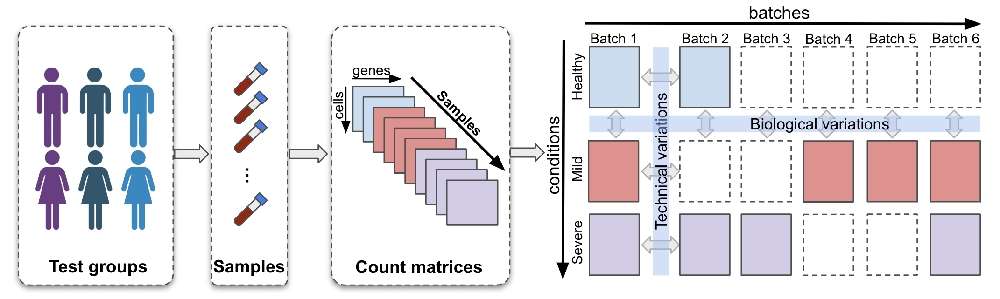

## scDisInFact

### Description
scDisInFact is a single-cell data integration and condition effect prediction framework. Given a multi-batches multi-conditions scRNA-seq dataset (see figure below), scDisInFact is able to 
* Disentangling the shared-bio factors (condition-irrelevant) and unshared-bio factors (condition-related), and remove technical batch effect.
* Detect condition-associated key genes for each condition type.
* Predict the condition effect on gene expression data (Perturbation prediction) and remove the batch effect in gene expression data.

Preprint is available on [biorxiv](https://www.biorxiv.org/content/10.1101/2023.05.01.538975v1?rss=1).



scDisInFact is designed using a conditional variational autoencoder framework. See figure below for the network structure of scDisInFact:


### Dependency
```
    python >= 3.7
    pytorch >= 1.11.0
    sklearn >= 0.22.1
    numpy >= 1.21.6
    pandas >= 1.3.5
    scipy >- 1.7.3
    matplotlib >= 3.5.2
```

### Directory
* `src` stores the source code of scDisInFact.
* `test` stores the testing script of scDisInFact (used in the manuscript). Testing datasets in manuscript are not included due to the size and are available upon request.
* `data` stores the testing data of scDisInFact.     

### Data
The test dataset in the manuscript is available upon request.

### Installation
Install the package by running the following command in the package root directory
```
pip install .
```

### Usage
1. Given the input count matrix `counts` (`numpy.array` of the shape `(ncells, ngenes)`) and meta data `meta_cells` (`pandas.dataframe` of the shape `(ncells, xx)`), we first create scdisinfact dataset using
```python
import scdisinfact
data_dict = scdisinfact.create_scdisinfact_dataset(counts[train_idx,:], meta_cells.loc[train_idx,:], condition_key = ["condition 1", "condition 2"], batch_key = "batch")
```
**Note**: `meta_cells` must include columns corresponding to the batch ID and condition of each cells, and the cells in `meta_cells` should match `counts`. In the example above, we have two condition types: `condition 1` and `condition 2` in `meta_cells`, and the batch ID is stored in `batch` column of of `meta_cells`.

1. Train scdisinfact with the count matrix
```python
# declare latent dimensions, we have two condition types, so there are three element corresponding to 
# shared-bio factor, unshared-bio factor for condition 1, unshared-bio factor for condition 2
Ks = [8, 4, 4]
# training device
device = torch.device("cuda:0" if torch.cuda.is_available() else "cpu")
model = scdisinfact.scdisinfact(data_dict = data_dict, Ks = Ks, device = device)
losses = model.train_model(nepochs = 100)
_ = model.eval()
```

1. Extract shared-bio factor and unshared-bio factors. Shared-bio factor is removed of batch and condition effect.
```python
# one forward pass
z_cs = []
z_ds = []
zs = []

# loop through all training count matrices
for dataset in data_dict["datasets"]:
    with torch.no_grad():
        # pass through the encoders
        dict_inf = model.inference(counts = dataset.counts_norm.to(model.device), batch_ids = dataset.batch_id[:,None].to(model.device), print_stat = True)
        # pass through the decoder
        dict_gen = model.generative(z_c = dict_inf["mu_c"], z_d = dict_inf["mu_d"], batch_ids = dataset.batch_id[:,None].to(model.device))
        z_c = dict_inf["mu_c"]
        z_d = dict_inf["mu_d"]
        mu = dict_gen["mu"]    
        z_ds.append([x.cpu().detach().numpy() for x in z_d])
        z_cs.append(z_c.cpu().detach().numpy())

# shared-bio factor, concatenate across all training matrices
z_cs = np.concatenate(z_cs, axis = 0)
# unshared-bio factors for conditions 1 and 2
z_ds_cond1 = np.concatenate([x[0] for x in z_ds], axis = 0)
z_ds_cond2 = np.concatenate([x[1] for x in z_ds], axis = 0)
```

4. Key gene detection
```python
gene_scores = model.extract_gene_scores()
# scores for condition type 1
genes_scores[0]
# scores for condition type 2
genes_scores[1]
```

5. Perturbation prediction. Given input count matrix corresponding to `(stim, severe, batch 1)` and predict the count corresponding to `(ctrl, healthy, batch 0)`, the code follows:
```python
input_idx = ((meta_cells["condition 1"] == "stim") & (meta_cells["condition 2"] == "severe") & (meta_cells["batch"] == 1)).values
counts_input = counts[input_idx,:].toarray()
meta_input = meta_cells.loc[input_idx,:]

counts_predict = model.predict_counts(input_counts = counts_input, meta_cells = meta_input, condition_keys = ["condition 1", "condition 2"], 
                                      batch_key = "batch", predict_conds = ["ctrl", "healthy"], predict_batch = 0)

```
Please check [demo.ipynb](https://github.com/ZhangLabGT/scDisInFact/blob/main/demo.ipynb) and detailed function description for the usage of scDisInFact.

### Contact
* Ziqi Zhang: ziqi.zhang@gatech.edu
* Xiuwei Zhang: xiuwei.zhang@gatech.edu
